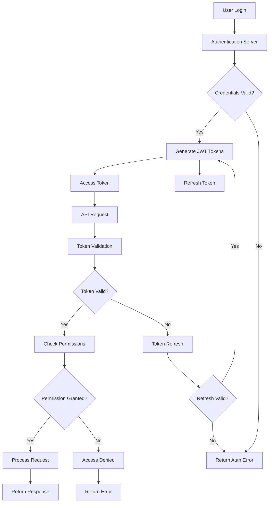

# User Management

<div className="flex gap-2 mb-6">
  <div className="inline-flex items-center rounded-md bg-green-50 px-2 py-1 text-xs font-medium text-green-700 ring-1 ring-inset ring-green-600/20 dark:bg-green-400/10 dark:text-green-400 dark:ring-green-400/30">
    <span className="text-xs">Community Edition</span>
  </div>
  <div className="inline-flex items-center rounded-md bg-blue-50 px-2 py-1 text-xs font-medium text-blue-700 ring-1 ring-inset ring-blue-700/10 dark:bg-blue-400/10 dark:text-blue-400 dark:ring-blue-400/30">
    <span className="text-xs">Basic Auth</span>
  </div>
</div>

Every Karrio project comes with comprehensive user management capabilities, providing organization-based access control, role-based permissions, user invitations, and secure authentication for enterprise deployments.

## Features

### Organization-Based Access Control

You don't have to build user management from scratch. Our system provides multi-organization support with isolated user access and resource management.

<div className="bg-gray-50 dark:bg-gray-900 rounded-lg p-4 my-6">
  <div className="text-sm text-gray-600 dark:text-gray-400 mb-2">
    User Management Dashboard
  </div>
  <div className="bg-white dark:bg-gray-800 rounded border h-64 flex items-center justify-center">
    <span className="text-gray-400">
      Screenshot: User roles, permissions, and organization management interface
    </span>
  </div>
</div>

### Role-Based Permissions

Assign granular permissions with predefined roles or create custom roles tailored to your business needs.

### User Invitations & Onboarding

Send email invitations with automatic user onboarding and role assignment for seamless team collaboration.

### Secure Authentication

JWT-based authentication with token management, refresh capabilities, and optional two-factor authentication.

### Audit & Activity Tracking

Monitor user actions, access patterns, and permission changes with comprehensive audit trails.

### Additional features

- Karrio extends user management with API key management and rate limiting controls.
- Every user interaction includes automatic session management and security monitoring.
- Karrio manages user preferences and customizable dashboard configurations.
- Support for SSO integration and external authentication providers.

## Data Flow

### User Authentication & Authorization Flow



## API Reference

### REST API

#### User Registration (Sign Up)

```bash
curl -X POST "https://api.karrio.io/api/register" \
  -H "Content-Type: application/json" \
  -d '{
    "email": "newuser@example.com",
    "password1": "secure_password123",
    "password2": "secure_password123",
    "first_name": "John",
    "last_name": "Doe"
  }'
```

**Response:**

```json
{
  "user": {
    "id": "usr_1234567890",
    "email": "newuser@example.com",
    "first_name": "John",
    "last_name": "Doe",
    "is_active": false,
    "date_joined": "2024-01-15T08:00:00Z"
  },
  "message": "Verification email sent. Please check your email to activate your account."
}
```

#### Email Verification

```bash
curl -X POST "https://api.karrio.io/api/verify-email" \
  -H "Content-Type: application/json" \
  -d '{
    "key": "verification_token_from_email"
  }'
```

**Response:**

```json
{
  "detail": "Email verified successfully. Your account is now active."
}
```

#### User Authentication (Sign In)

```bash
curl -X POST "https://api.karrio.io/api/token" \
  -H "Content-Type: application/json" \
  -d '{
    "username": "user@example.com",
    "password": "secure_password"
  }'
```

**Response:**

```json
{
  "access": "eyJ0eXAiOiJKV1QiLCJhbGciOiJIUzI1NiJ9.eyJ1c2VyX2lkIjoxLCJ1c2VybmFtZSI6InVzZXJAZXhhbXBsZS5jb20iLCJleHAiOjE2NDI2ODEyMDB9.xyz",
  "refresh": "eyJ0eXAiOiJKV1QiLCJhbGciOiJIUzI1NiJ9.eyJ1c2VyX2lkIjoxLCJleHAiOjE2NDI3Njc2MDB9.abc",
  "user": {
    "id": "usr_1234567890",
    "email": "user@example.com",
    "first_name": "John",
    "last_name": "Doe",
    "is_active": true,
    "date_joined": "2024-01-15T08:00:00Z"
  }
}
```

#### Password Reset Request

```bash
curl -X POST "https://api.karrio.io/api/password/reset" \
  -H "Content-Type: application/json" \
  -d '{
    "email": "user@example.com"
  }'
```

**Response:**

```json
{
  "detail": "Password reset email sent. Please check your email for reset instructions."
}
```

#### Password Reset Confirm

```bash
curl -X POST "https://api.karrio.io/api/password/reset/confirm" \
  -H "Content-Type: application/json" \
  -d '{
    "uid": "user_id_from_email",
    "token": "reset_token_from_email",
    "new_password1": "new_secure_password123",
    "new_password2": "new_secure_password123"
  }'
```

**Response:**

```json
{
  "detail": "Password has been reset successfully."
}
```

#### Refresh Token

```bash
curl -X POST "https://api.karrio.io/api/token/refresh" \
  -H "Content-Type: application/json" \
  -d '{
    "refresh": "eyJ0eXAiOiJKV1QiLCJhbGciOiJIUzI1NiJ9.eyJ1c2VyX2lkIjoxLCJleHAiOjE2NDI3Njc2MDB9.abc"
  }'
```

**Response:**

```json
{
  "access": "eyJ0eXAiOiJKV1QiLCJhbGciOiJIUzI1NiJ9.eyJ1c2VyX2lkIjoxLCJ1c2VybmFtZSI6InVzZXJAZXhhbXBsZS5jb20iLCJleHAiOjE2NDI2ODEyMDB9.new_token"
}
```

#### Verify Token

```bash
curl -X POST "https://api.karrio.io/api/token/verify" \
  -H "Content-Type: application/json" \
  -d '{
    "token": "eyJ0eXAiOiJKV1QiLCJhbGciOiJIUzI1NiJ9.eyJ1c2VyX2lkIjoxLCJ1c2VybmFtZSI6InVzZXJAZXhhbXBsZS5jb20iLCJleHAiOjE2NDI2ODEyMDB9.xyz"
  }'
```

**Response (Valid Token):**

```json
{
  "valid": true,
  "user": {
    "id": "usr_1234567890",
    "email": "user@example.com",
    "organizations": [
      {
        "id": "org_1234567890",
        "name": "Acme Corporation",
        "role": "admin"
      }
    ]
  }
}
```

#### Get Current User

```bash
curl -X GET "https://api.karrio.io/v1/users/me" \
  -H "Authorization: Token YOUR_API_KEY"
```

**Response:**

```json
{
  "id": "usr_1234567890",
  "email": "user@example.com",
  "first_name": "John",
  "last_name": "Doe",
  "is_active": true,
  "date_joined": "2024-01-15T08:00:00Z",
  "organizations": [
    {
      "id": "org_1234567890",
      "name": "Acme Corporation",
      "role": "admin",
      "permissions": ["create_shipments", "manage_users", "view_analytics"]
    }
  ]
}
```

### GraphQL API

#### User Registration Mutation

```graphql
mutation RegisterUser($input: RegisterUserMutationInput!) {
  register_user(input: $input) {
    user {
      id
      email
      first_name
      last_name
      is_active
      date_joined
    }
    errors {
      field
      messages
    }
  }
}
```

**Variables:**

```json
{
  "input": {
    "email": "newuser@example.com",
    "password1": "secure_password123",
    "password2": "secure_password123",
    "first_name": "John",
    "last_name": "Doe"
  }
}
```

**Response:**

```json
{
  "data": {
    "register_user": {
      "user": {
        "id": "usr_1234567890",
        "email": "newuser@example.com",
        "first_name": "John",
        "last_name": "Doe",
        "is_active": false,
        "date_joined": "2024-01-15T08:00:00Z"
      },
      "errors": []
    }
  }
}
```

#### Verify Email Mutation

```graphql
mutation VerifyEmail($input: VerifyEmailMutationInput!) {
  verify_email(input: $input) {
    success
    errors {
      field
      messages
    }
  }
}
```

**Variables:**

```json
{
  "input": {
    "key": "verification_token_from_email"
  }
}
```

**Response:**

```json
{
  "data": {
    "verify_email": {
      "success": true,
      "errors": []
    }
  }
}
```

#### Token Authentication Mutation

```graphql
mutation TokenAuth($input: TokenAuthMutationInput!) {
  token_auth(input: $input) {
    token
    refresh_token
    user {
      id
      email
      first_name
      last_name
      is_active
    }
    errors {
      field
      messages
    }
  }
}
```

**Variables:**

```json
{
  "input": {
    "username": "user@example.com",
    "password": "secure_password"
  }
}
```

**Response:**

```json
{
  "data": {
    "token_auth": {
      "token": "eyJ0eXAiOiJKV1QiLCJhbGciOiJIUzI1NiJ9.eyJ1c2VyX2lkIjoxLCJ1c2VybmFtZSI6InVzZXJAZXhhbXBsZS5jb20iLCJleHAiOjE2NDI2ODEyMDB9.xyz",
      "refresh_token": "eyJ0eXAiOiJKV1QiLCJhbGciOiJIUzI1NiJ9.eyJ1c2VyX2lkIjoxLCJleHAiOjE2NDI3Njc2MDB9.abc",
      "user": {
        "id": "usr_1234567890",
        "email": "user@example.com",
        "first_name": "John",
        "last_name": "Doe",
        "is_active": true
      },
      "errors": []
    }
  }
}
```

#### Refresh Token Mutation

```graphql
mutation RefreshToken($input: RefreshTokenMutationInput!) {
  refresh_token(input: $input) {
    token
    errors {
      field
      messages
    }
  }
}
```

**Variables:**

```json
{
  "input": {
    "refresh_token": "eyJ0eXAiOiJKV1QiLCJhbGciOiJIUzI1NiJ9.eyJ1c2VyX2lkIjoxLCJleHAiOjE2NDI3Njc2MDB9.abc"
  }
}
```

**Response:**

```json
{
  "data": {
    "refresh_token": {
      "token": "eyJ0eXAiOiJKV1QiLCJhbGciOiJIUzI1NiJ9.eyJ1c2VyX2lkIjoxLCJ1c2VybmFtZSI6InVzZXJAZXhhbXBsZS5jb20iLCJleHAiOjE2NDI2ODQyMDB9.new_token",
      "errors": []
    }
  }
}
```

#### Password Reset Request Mutation

```graphql
mutation PasswordReset($input: PasswordResetMutationInput!) {
  password_reset(input: $input) {
    success
    errors {
      field
      messages
    }
  }
}
```

**Variables:**

```json
{
  "input": {
    "email": "user@example.com"
  }
}
```

**Response:**

```json
{
  "data": {
    "password_reset": {
      "success": true,
      "errors": []
    }
  }
}
```

#### Password Reset Confirm Mutation

```graphql
mutation PasswordResetConfirm($input: PasswordResetConfirmMutationInput!) {
  password_reset_confirm(input: $input) {
    success
    errors {
      field
      messages
    }
  }
}
```

**Variables:**

```json
{
  "input": {
    "uid": "user_id_from_email",
    "token": "reset_token_from_email",
    "new_password1": "new_secure_password123",
    "new_password2": "new_secure_password123"
  }
}
```

**Response:**

```json
{
  "data": {
    "password_reset_confirm": {
      "success": true,
      "errors": []
    }
  }
}
```

#### Query Current User

```graphql
query GetCurrentUser {
  user {
    id
    email
    first_name
    last_name
    is_active
    date_joined
    organizations {
      id
      name
      role
      permissions
    }
  }
}
```

**Response:**

```json
{
  "data": {
    "user": {
      "id": "usr_1234567890",
      "email": "user@example.com",
      "first_name": "John",
      "last_name": "Doe",
      "is_active": true,
      "date_joined": "2024-01-15T08:00:00Z",
      "organizations": [
        {
          "id": "org_1234567890",
          "name": "Acme Corporation",
          "role": "admin",
          "permissions": ["create_shipments", "manage_users", "view_analytics"]
        }
      ]
    }
  }
}
```

#### Query Users (Admin Only)

```graphql
query GetUsers($filter: UserFilter, $pagination: PaginationInput) {
  users(filter: $filter, pagination: $pagination) {
    edges {
      node {
        id
        email
        first_name
        last_name
        is_active
        date_joined
        organizations {
          id
          name
          role
        }
      }
    }
    pageInfo {
      hasNextPage
      hasPreviousPage
      startCursor
      endCursor
    }
  }
}
```

**Variables:**

```json
{
  "filter": {
    "is_active": true,
    "organization_id": "org_1234567890"
  },
  "pagination": {
    "first": 10
  }
}
```

**Response:**

```json
{
  "data": {
    "users": {
      "edges": [
        {
          "node": {
            "id": "usr_1234567890",
            "email": "user@example.com",
            "first_name": "John",
            "last_name": "Doe",
            "is_active": true,
            "date_joined": "2024-01-15T08:00:00Z",
            "organizations": [
              {
                "id": "org_1234567890",
                "name": "Acme Corporation",
                "role": "admin"
              }
            ]
          }
        }
      ],
      "pageInfo": {
        "hasNextPage": false,
        "hasPreviousPage": false,
        "startCursor": "cursor1",
        "endCursor": "cursor1"
      }
    }
  }
}
```

#### Update User Profile Mutation

```graphql
mutation UpdateUserProfile($input: UpdateUserProfileMutationInput!) {
  update_user_profile(input: $input) {
    user {
      id
      email
      first_name
      last_name
    }
    errors {
      field
      messages
    }
  }
}
```

**Variables:**

```json
{
  "input": {
    "first_name": "John Updated",
    "last_name": "Doe Updated"
  }
}
```

**Response:**

```json
{
  "data": {
    "update_user_profile": {
      "user": {
        "id": "usr_1234567890",
        "email": "user@example.com",
        "first_name": "John Updated",
        "last_name": "Doe Updated"
      },
      "errors": []
    }
  }
}
```

#### Send User Invitations

```graphql
mutation SendInvitations($input: SendInvitationsMutationInput!) {
  send_invitations(input: $input) {
    invitations {
      id
      email
      organization {
        id
        name
      }
      role
      expires_at
    }
    errors {
      field
      messages
    }
  }
}
```

**Variables:**

```json
{
  "input": {
    "emails": ["newuser@example.com", "colleague@example.com"],
    "organization_id": "org_1234567890",
    "role": "user"
  }
}
```

**Response:**

```json
{
  "data": {
    "send_invitations": {
      "invitations": [
        {
          "id": "inv_1234567890",
          "email": "newuser@example.com",
          "organization": {
            "id": "org_1234567890",
            "name": "Acme Corporation"
          },
          "role": "user",
          "expires_at": "2024-01-22T10:30:00Z"
        }
      ],
      "errors": []
    }
  }
}
```

## User Roles & Permissions

### Standard Roles

Built-in roles with predefined permission groups:

#### Owner

- **Permissions**: `manage_org_owner`
- **Capabilities**: Complete organization ownership and control
- **Restrictions**: Only available to organization owners

#### Admin

- **Permissions**: `manage_team`, `manage_apps`, `manage_carriers`
- **Capabilities**: Team management, application settings, carrier connections
- **Restrictions**: Cannot transfer organization ownership

#### Developer

- **Permissions**: `manage_webhooks`
- **Capabilities**: Webhook configuration and API integrations
- **Restrictions**: Limited to development and integration tasks

#### Member

- **Permissions**: `manage_data`, `manage_orders`, `manage_pickups`, `manage_trackers`, `manage_shipments`
- **Capabilities**: Core shipping operations, order management, tracking
- **Restrictions**: Cannot manage users or organization settings

### Permission Groups

The actual permission system uses these groups:

```json
{
  "permission_groups": [
    "manage_apps",
    "manage_team",
    "manage_system",
    "manage_orders",
    "manage_data",
    "manage_pickups",
    "manage_carriers",
    "manage_trackers",
    "manage_webhooks",
    "manage_shipments",
    "manage_org_owner"
  ]
}
```

## Organization Management

Organization management is handled by a separate system. For detailed information about creating organizations, managing teams, and organization-level features, see our [Multi-Organizations documentation](/docs/products/multi-orgs).

## Use Cases

### Team Collaboration

Perfect for teams managing shipping operations:

- **Role Assignment**: Assign appropriate roles based on responsibilities
- **Access Control**: Limit access to sensitive operations and data
- **Audit Trail**: Track who performed what actions and when
- **Invitation Workflow**: Easily onboard new team members

### Enterprise Deployment

Designed for large organizations with complex requirements:

- **Permission Groups**: Fine-grained control over feature access using permission groups
- **User Provisioning**: Automated user creation and role assignment
- **Compliance Reporting**: Detailed audit logs for compliance requirements
- **Multi-Organization Support**: See [Multi-Organizations](/docs/products/multi-orgs) for details

### Partner Integration

Enable external partners and vendors to access specific resources:

- **Limited Access**: Provide specific permission groups for controlled access
- **Resource Isolation**: Keep partner data separate using organizational boundaries
- **Temporary Access**: Set expiration dates for partner accounts
- **Activity Monitoring**: Track partner usage and access patterns

## Security Features

### Authentication Options

#### Standard Authentication

```bash
# Username/password authentication
curl -X POST "https://api.karrio.io/api/token" \
  -H "Content-Type: application/json" \
  -d '{
    "username": "user@example.com",
    "password": "secure_password"
  }'
```

#### Two-Factor Authentication

```bash
# 2FA authentication with OTP
curl -X POST "https://api.karrio.io/api/token/verified" \
  -H "Content-Type: application/json" \
  -d '{
    "username": "user@example.com",
    "password": "secure_password",
    "otp_token": "123456"
  }'
```

### API Key Management

Generate and manage API keys for programmatic access:

```javascript
// API keys are managed through the admin dashboard
// Use the web interface to create and manage API keys
// Each key can be assigned specific permissions and expiration dates
```

## Integration Examples

### User Onboarding Workflow

```javascript
// User invitations are handled through the admin dashboard
// Invitations are sent via email with secure acceptance links
// Users create their accounts by following the invitation link
```

### Permission Management

```javascript
// User permissions are managed through the admin dashboard
// Admins can update permission groups for team members
// Changes take effect immediately for the user's session
```

## Getting Started

Ready to set up user management in Karrio? Follow these steps:

1. **Register users** and handle email verification
2. **Assign appropriate permission groups** based on responsibilities
3. **Set up authentication** for your application
4. **Configure role-based access** for different user types

### Next Steps

- Learn about [multi-orgs](/docs/products/multi-orgs) for advanced organization management
- Explore [webhooks](/docs/products/webhooks) for user activity notifications
- Set up [API logs](/docs/products/api-logs) to monitor user API usage
- Configure [admin console](/docs/products/admin-console) for centralized management
