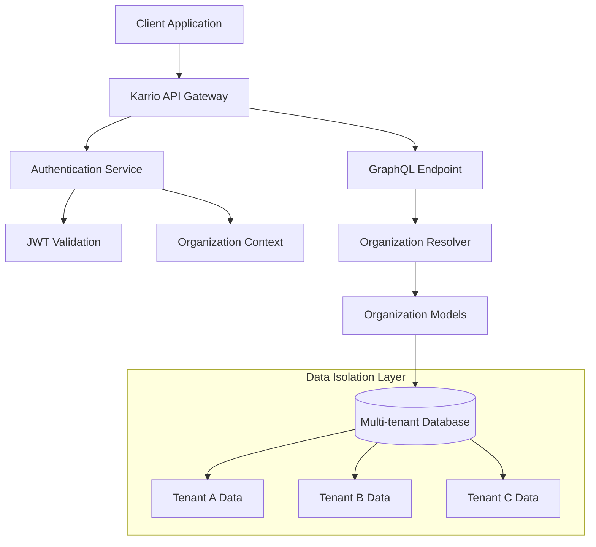
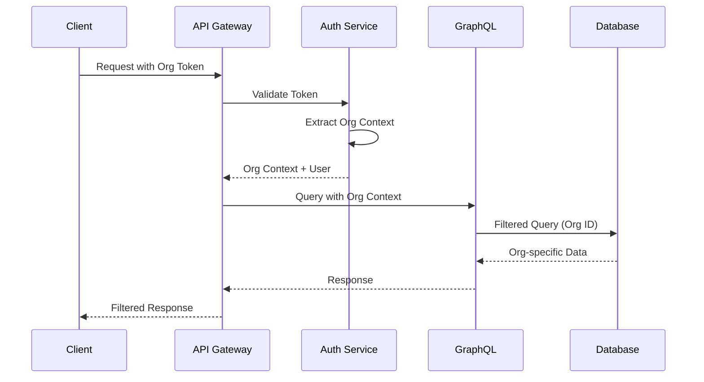
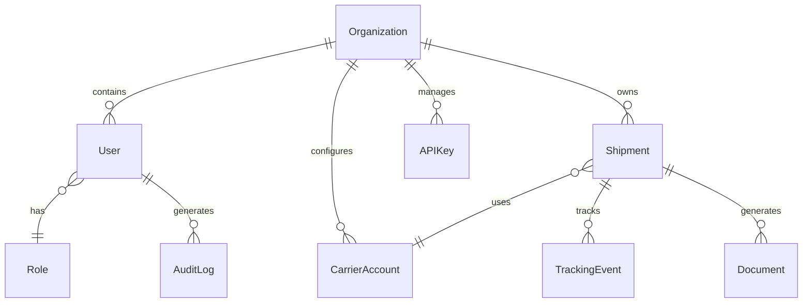

# Our Experience Refactoring and Maintaining the Karrio Large Codebase with AI

At Karrio, we're shipping one of the most sophisticated multi-carrier shipping platforms in the market. With 35+ carrier integrations, multi-tenant architecture, OAuth systems, and hundreds of thousands of lines of code across Django backends, React frontends, and GraphQL APIs, we've learned some hard truths about AI-assisted development.

Our observations align with industry publications: **AI struggles with large legacy codebases, often overthinking solutions and creating buggy code it can't debug itself.** But we've discovered specific techniques that transform AI from a code-breaking liability into our most powerful development accelerator.

## The Reality of AI and Large Legacy Codebases

Most AI coding discussions focus on greenfield projects or simple scripts. But what happens when you're staring at 20+ Django modules with intricate relationships, custom authentication systems juggling JWT and OAuth2, multi-tenant data isolation across dozens of models, carrier integration patterns that must scale to 100+ providers, and GraphQL schemas with thousands of types and mutations?

**The conventional wisdom is right.** AI models do break things in large legacy codebases. We've watched Claude overthink solutions, create overly complicated implementations, and generate buggy code it can't debug. There's something about the cognitive load of large systems that causes these models to lose their way, much like how human developers can get overwhelmed by architectural complexity.

But here's what we've discovered through months of experimentation and countless failed attempts: **these problems are solvable when you give the model the right architectural context and constraints.** The key insight isn't that AI models are bad at legacy code—it's that they need to understand the system the same way a senior developer would when joining a new team. Once you solve the context problem, these tools transform from a code-breaking liability into incredibly powerful systems for understanding, documenting, and extending sophisticated software.

## Our AI-Powered Development Stack

### Cursor + Claude Sonnet: The Unmatched Combination

After testing extensively across different AI coding tools—from GitHub Copilot to CodeT5 to various GPT-4 implementations—we've found that **Claude Sonnet through Cursor consistently outperforms everything else** for both architectural planning and implementation. There's something magical about how Claude maintains context across long conversations while Cursor provides the seamless integration that makes AI-assisted coding feel natural.

Claude's deep architectural reasoning allows it to hold complex system designs in context for hours-long development sessions. It recognizes our established conventions and maintains consistency across different modules, almost like it's internalized our coding standards. Most importantly, it can write production-ready code that passes our stringent review standards—not just prototype code that looks good at first glance.

### The Trust-But-Verify Pattern

Our approach has evolved into what we call "trust-but-verify copilot mode." Claude generates comprehensive implementations based on the architectural context we provide, but every single line gets reviewed by a senior developer with a critical eye toward architectural consistency, security implications, performance considerations, and integration points with existing systems.

This isn't about replacing developer judgment—it's about amplifying it. Think of it like having a brilliant junior developer who can code at superhuman speed but needs constant guidance on architectural decisions. The model handles the mechanical complexity of translating requirements into code, while humans focus on the higher-level design decisions and system integration challenges that truly matter.

## LLM-Generated Architecture Documentation: The Game Changer

The biggest breakthrough in our AI-assisted development journey has been using the model to generate comprehensive Product Requirements Documents (PRDs) that serve as living architectural documentation. These aren't just planning documents gathering dust in a wiki—they're implementation blueprints that teams can execute immediately.

### Our PRD Generation Template

We've spent months iterating on a sophisticated prompt template that produces 800+ line architectural documents complete with system architecture diagrams rendered in Mermaid, comprehensive data flow analysis, implementation-ready code examples, testing strategies that actually work, and security and performance considerations that pass production scrutiny.

Here's our core PRD generation template prompt:

```markdown
# Advanced Karrio PRD Generation Prompt Template

## 🎯 **Template Purpose**

This template provides a comprehensive framework for generating detailed Product Requirements Documents (PRDs) and Implementation Specifications for Karrio features. It follows the established patterns from successful Karrio PRDs and ensures consistency, thoroughness, and technical depth.

## 📋 **PRD Generation Prompt Template**

### **Core Prompt Structure**

You are tasked with creating a comprehensive Product Requirements Document (PRD) for [FEATURE_NAME] in the Karrio shipping platform. This PRD should serve as a complete technical specification that enables developers, AI agents, and stakeholders to understand, implement, maintain, and extend the feature.

## Context and Requirements

**Feature Name**: [FEATURE_NAME]
**Feature Category**: [API/Backend/Frontend/Integration/Engine/Automation]
**Target Users**: [Developers/End Users/Partners/Administrators]
**Business Objective**: [Primary business goal this feature serves]
**Technical Complexity**: [Low/Medium/High/Complex]
**Integration Points**: [List of systems this feature interacts with]

## Required Document Structure

Create a PRD following this exact structure:

### 1. Executive Summary (🎯)

- **Purpose**: Clear business objective and value proposition
- **Scope**: What is included and excluded from this feature
- **Success Metrics**: Measurable outcomes and KPIs
- **Timeline**: High-level implementation phases

### 2. Architecture Overview (🏗️)

- **System Architecture Diagram**: Mermaid diagram showing how the feature fits into Karrio
- **Component Integration**: How it connects with existing systems
- **Data Flow**: High-level data movement and processing
- **Dependency Map**: Required and optional dependencies

### 3. Technical Specification (📊)

- **Data Models**: Complete model definitions with relationships
- **API Schema**: GraphQL types, inputs, and mutations
- **Business Logic**: Core algorithms and processing logic
- **Security Considerations**: Authentication, authorization, validation

### 4. Implementation Details (🔧)

- **Core Components**: Detailed technical implementation
- **Processing Pipeline**: Step-by-step execution flow
- **Error Handling**: Comprehensive error scenarios and responses
- **Performance Considerations**: Scalability and optimization requirements

### 5. API Integration (🌐)

- **GraphQL Schema**: Complete schema definitions
- **REST Endpoints**: Any REST API surfaces
- **Request/Response Examples**: Actual JSON examples
- **Authentication Flow**: How API access is secured

### 6. Data Flow Diagrams (🔄)

- **Primary Use Case Flow**: Main user journey as Mermaid sequence diagram
- **Error Flow**: How errors are handled and propagated
- **Integration Flow**: How external systems interact
- **Processing Pipeline**: Internal data transformation flow

### 7. Current Implementation Status (✅❌)

- **What's Implemented**: Detailed inventory of working features
- **Current Limitations**: Technical and functional constraints
- **Known Issues**: Bugs, performance problems, missing features
- **Dependencies**: What needs to be built first

### 8. Testing Strategy (🧪)

- **Unit Testing**: Core logic and model testing
- **Integration Testing**: API and system integration tests
- **End-to-End Testing**: Complete user workflow testing
- **Performance Testing**: Load and stress testing requirements

### 9. Future Roadmap (🔮)

- **Phase 1**: Immediate improvements and fixes
- **Phase 2**: Major enhancements and new capabilities
- **Phase 3**: Advanced features and optimization
- **Long-term Vision**: Strategic direction and possibilities

### 10. Implementation Examples (📚)

- **Basic Usage**: Simple, common use cases
- **Advanced Usage**: Complex scenarios and edge cases
- **Integration Examples**: How to integrate with external systems
- **Configuration Examples**: Setup and customization options

### 11. Developer Guide (🔧)

- **Setup Instructions**: How to enable and configure the feature
- **Development Workflow**: How to build and test changes
- **Debugging Guide**: How to troubleshoot issues
- **Extension Points**: How to customize and extend functionality

## Required Diagram Types

Include these specific Mermaid diagrams:

1. **System Architecture**: How the feature fits into Karrio's overall architecture
2. **Component Diagram**: Internal component relationships and dependencies
3. **Sequence Diagram**: Primary user interaction flow
4. **Data Flow Diagram**: How data moves through the system
5. **State Diagram**: If applicable, state transitions and lifecycle
6. **Entity Relationship**: Database schema and relationships

## Technical Depth Requirements

**Code Examples**: Include actual Python, TypeScript, and GraphQL code snippets
**Configuration**: Show actual configuration files and settings
**API Examples**: Provide complete curl commands and responses
**Error Scenarios**: Document specific error conditions and responses
**Performance Metrics**: Include benchmarks, targets, and monitoring

## Quality Standards

**Accuracy**: All code and examples must be syntactically correct
**Completeness**: Cover all major use cases and edge cases
**Clarity**: Write for both technical and non-technical stakeholders
**Actionability**: Provide enough detail for immediate implementation
**Maintainability**: Structure for easy updates and revisions
```

This template has enabled us to generate comprehensive architectural documents that would have taken senior architects weeks to create manually. Our multi-tenant organization management system required a 758-line PRD with complete data isolation architecture. The OAuth2 integration system needed a 358-line PRD with security hardening specifications that satisfy enterprise requirements. The app marketplace platform demanded an 823-line PRD with embedded UI framework architecture that rivals Shopify's app ecosystem.

Each document includes production-ready code examples that compile and run, comprehensive test strategies that actually catch bugs, and implementation roadmaps that teams can execute immediately. These aren't academic exercises—they're battle-tested architectural specifications that have guided real implementations in production systems.

### AI-Generated Data Flow Visualizations

One of the most valuable outputs from our AI-assisted documentation process is the comprehensive data flow diagrams that Claude generates. These visualizations have become essential for understanding complex system interactions and onboarding new developers to our architecture.

When we ask Claude to document a feature like our multi-tenant organization system, it automatically generates several types of diagrams:

**System Architecture Overview:**



**Request Flow Sequence:**



**Data Relationship Mapping:**



These diagrams serve multiple critical purposes in our development workflow. They help new developers understand complex system relationships without diving into thousands of lines of code. They document architectural decisions for future reference and maintenance. They identify potential integration issues before implementation begins. And they provide visual validation that our data isolation strategies actually work as intended.

The most valuable aspect is that Claude generates these diagrams automatically based on the code context we provide. When we're planning a new feature integration, we can get comprehensive architectural visualization in minutes rather than spending hours manually creating documentation that might become outdated.

## Convention-Driven Development: Teaching Claude Our Patterns

The key to success with AI models in large legacy codebases is **establishing strong conventions and patterns**. We've built standardized templates and abstractions that help the model understand and maintain our architectural decisions.

### Carrier Integration Templates

Our carrier integration system uses code generation templates that maintain consistency across 35+ providers:

```python
# Template structure for carrier integrations
PROVIDER_RATE_TEMPLATE = Template('''
"""Karrio {{name}} rate API implementation."""

import karrio.schemas.{{id}}.rate_request as {{id}}_req
import karrio.schemas.{{id}}.rate_response as {{id}}_res

import typing
import karrio.lib as lib
import karrio.core.models as models
import karrio.providers.{{id}}.error as error
import karrio.providers.{{id}}.utils as provider_utils

def parse_rate_response(
    _response: lib.Deserializable[lib.Elementdict],
    settings: provider_utils.Settings,
) -> typing.Tuple[typing.List[models.RateDetails], typing.List[models.Message]]:
    response = _response.deserialize()
    messages = error.parse_error_response(response, settings)

    # Extract rate objects - AI knows to customize this section
    
    rate_elements = response.xpath(".//rate") if hasattr(response, 'xpath') else []
    rates = [_extract_details(rate, settings) for rate in rate_elements]
    
    rate_objects = response.get("rates", []) if hasattr(response, 'get') else []
    rates = [_extract_details(rate, settings) for rate in rate_objects]
    

    return rates, messages
''')
```

### Django App Structure Conventions

We maintain consistent module organization across all Django apps:

```text
modules/
  ├── manager/          # Shipment and parcel management
  ├── orders/           # Order processing
  ├── documents/        # Label and document generation
  ├── events/           # Webhook and event handling
  └── graph/            # GraphQL schema definitions
```

When Claude generates new features, it automatically follows these patterns, reducing integration complexity and maintaining architectural consistency.

## The Context Problem: Why Directory References Don't Work

Here's a critical lesson we learned the hard way: **AI models need explicit file context, not directory listings.** We spent weeks wondering why our implementations kept missing crucial implementation details, until we realized that referencing entire directories doesn't work effectively. The model won't actually read everything in a directory—it skims, makes assumptions, and inevitably misses the architectural patterns that matter most.

The solution became clear once we started treating Claude like a new team member who needs specific, focused onboarding. Instead of saying "look at the /modules/manager/ directory," we manually attach the specific files that matter: the core models file, the serializers that define API behavior, and the GraphQL schema types that expose functionality. This focused approach gives the model the precise context it needs without cognitive overload, much like how you'd onboard a senior developer by showing them the three most important files in a system rather than dumping them into a directory with fifty files.

## Test-Driven LLM Development

Test-driven development has become absolutely crucial for LLM-assisted coding, but not for the reasons you might expect. Tests serve as both specification and validation, but more importantly, they act as a contract that keeps the model from going off the rails. When Claude has clear test cases to work against, it becomes remarkably focused and practical—no more overthinking simple problems or creating unnecessarily complex abstractions.

### LLM-Generated Test Patterns

We've trained Claude to generate comprehensive test suites that follow our established patterns, creating a feedback loop where good tests lead to better implementations:

```python
class TestCarrierIntegration(GraphTestCase):
    def setUp(self):
        self.maxDiff = None
        self.RateRequest = models.RateRequest(**RatePayload)

    def test_create_rate_request(self):
        request = gateway.mapper.create_rate_request(self.RateRequest)
        self.assertEqual(lib.to_dict(request.serialize()), RateRequest)

    def test_parse_rate_response(self):
        with patch("karrio.mappers.carrier.proxy.lib.request") as mock:
            mock.return_value = RateResponse
            parsed_response = (
                karrio.Rating.fetch(self.RateRequest)
                .from_(gateway)
                .parse()
            )
            self.assertResponseNoErrors(parsed_response)
            self.assertDict(lib.to_dict(parsed_response), ParsedRateResponse)
```

Claude generates these tests automatically, but human developers review with a critical eye toward edge case coverage that might break in production, integration scenarios that could cause downstream failures, performance implications that might not surface until scale, and security considerations that could become vulnerabilities. This review process has caught countless issues that would have made it to production otherwise.

## The Reality of LLM-Assisted Development

Let's be brutally honest: **this isn't magic.** Successful LLM-assisted development requires deep technical understanding that can't be faked or shortcut. You need to understand system architecture well enough to guide the model in the right direction when it inevitably takes wrong turns. You need to recognize data flow patterns to verify that generated implementations actually make sense in context. You need to identify integration points to catch architectural inconsistencies before they become production nightmares. And you need to evaluate performance implications to ensure LLM-generated solutions won't crumble under real-world load.

Our most successful implementations follow a predictable rhythm that's far from the "magical" experience often portrayed. We spend 2-4 hours of context preparation gathering relevant files and truly understanding requirements—this isn't busy work, it's the foundation that makes everything else possible. This is followed by 1-2 hours of iterative prompting to refine Claude's output through conversational feedback, then 2-3 hours of careful review and testing to validate that generated code actually works as intended, and finally 1-2 hours of integration work to ensure the new code plays nicely with existing systems.

This isn't "language models write code while you sleep." It's "Claude amplifies your development capacity by 3-5x when properly directed." The amplification is real and transformative, but it requires genuine effort, expertise, and focused attention to achieve.

## What We've Built at Unprecedented Pace

Using these LLM-assisted techniques, we've implemented enterprise-grade features that would traditionally take senior teams months to design, build, and test. Our multi-tenant organization system required 20+ link models for complete data isolation, a dual authentication system supporting both JWT and organization tokens, role-based permissions with context-aware enforcement, and 95%+ test coverage with comprehensive validation. This would have been a six-month project for our team—we completed it in three weeks.

The OAuth2 integration platform demanded Authorization Code Flow implementation with PKCE security hardening, app marketplace architecture with embedded UI framework capabilities, comprehensive security hardening that passes enterprise security reviews, and a production-ready implementation that rivals platforms like Shopify's app ecosystem. Traditional development timeline: four months. Our LLM-assisted timeline: five weeks.

Our carrier integration engine now supports 35+ carrier integrations using generated templates that maintain consistency across vastly different API patterns, unified API abstraction across XML and JSON providers, automatic code generation for new carrier integrations that reduces onboarding time from weeks to hours, and comprehensive error handling with retry logic that gracefully handles the unreliable nature of carrier APIs.

## Key Lessons for Large Legacy Codebase LLM Development

### 1. Context is Everything

Don't rely on language models to discover your architecture. **Explicitly provide the context they need**:

- Relevant implementation files
- Existing patterns and conventions
- Integration requirements
- Performance considerations

### 2. Establish Strong Conventions

**Claude excels when you have clear patterns to follow**:

- Consistent file organization
- Standardized code generation templates
- Established architectural patterns
- Clear naming conventions

### 3. Test-Driven Validation

**Use tests as both specification and validation**:

- Write tests first to define expected behavior
- Let the model implement against test specifications
- Use test failures to guide corrections
- Maintain comprehensive test coverage

### 4. Human Review is Non-Negotiable

**Language models amplify human capability—they don't replace it**:

- Review every line of generated code
- Validate architectural consistency
- Check performance implications
- Verify security considerations

### 5. Iterative Refinement Works

**Don't expect perfect code on the first try**:

- Use conversation to refine Claude's output
- Provide specific feedback on implementations
- Iterate until code meets your standards
- Build up context through conversation

## The Future of LLM-Assisted Development

We're still in the early stages of understanding how AI models can transform enterprise software development. Our experience suggests that **the future isn't models replacing developers—it's models enabling developers to tackle problems of unprecedented complexity and scale.**

At Karrio, we're using Claude to:

- **Understand and document** legacy systems that would take months to analyze manually
- **Generate comprehensive architectures** for complex features before implementation
- **Write and maintain** thousands of lines of test code
- **Scale our development capacity** without sacrificing code quality

The key insight: **AI models don't eliminate the need for deep technical understanding—they amplify it.** The developers who learn to work effectively with these tools will be able to build systems of complexity and scale that were previously impossible for small teams.

We've built Karrio as a small team through years of experimentation, testing, and reverse engineering poorly documented and lacking shipping carrier API services. Through countless hours of deep technical work, we've created something that often leaves people in awe—a platform that rivals what funded companies with hundreds of engineers have built. Our shipping platform handles millions of API requests, integrates with dozens of carriers, and serves hundreds of businesses.

Now with AI-assisted software engineering, we can do even more. These tools have allowed us to accelerate our already deep expertise, focusing on architectural decisions while handling the mechanical complexity of implementation that we've mastered through years of hands-on experience.

---

_Want to see this in action? Our entire codebase architecture, including all the PRDs and implementation patterns mentioned in this post, is available in our open-source repositories. The templates, test patterns, and architectural decisions described here are the actual tools we use every day to build and scale Karrio._
