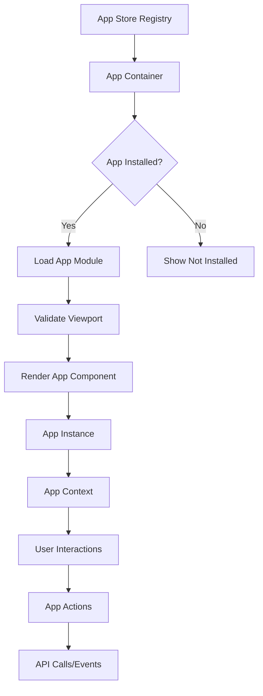
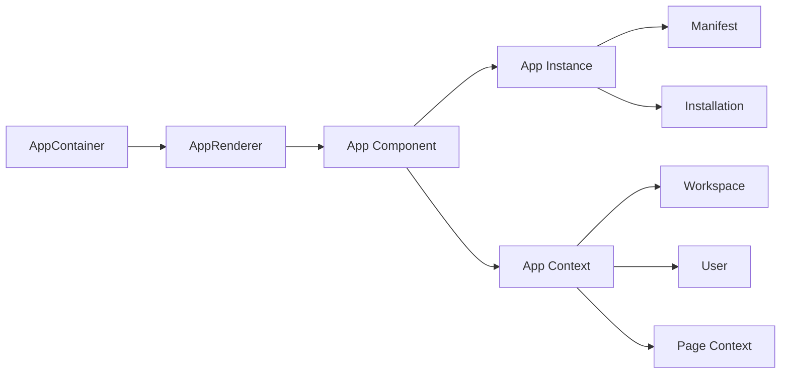

# @karrio/app-store

A powerful and extensible app platform for Karrio, inspired by Stripe Apps and Cal.com's app architecture. This package provides the foundation for building, loading, and managing Karrio apps.

## Overview

The Karrio app-store enables developers to:
- Build custom apps that integrate with Karrio
- Create marketplace apps for the community
- Embed apps in different parts of the Karrio interface
- Manage app installations and permissions
- Handle OAuth flows and API access

## Architecture

### Core Components

```
@karrio/app-store/
├── types.ts              # TypeScript definitions
├── utils.ts              # Utility functions
├── index.ts              # Main app store registry
├── components/
│   └── app-container.tsx # App loading and rendering
└── apps/
    └── greeter/          # Example app
        ├── index.ts      # App module export
        ├── manifest.ts   # App manifest
        └── component.tsx # React component
```

### Data Flow



### Component Architecture



## App Manifest

Every Karrio app must export a manifest that defines its capabilities:

```typescript
import type { AppManifest } from "@karrio/app-store/types";

const manifest: AppManifest = {
  id: "my-app",
  name: "My App",
  slug: "my-app",
  version: "1.0.0",
  description: "My awesome Karrio app",
  developer: {
    name: "Your Company",
    email: "hello@yourcompany.com",
    website: "https://yourcompany.com",
  },
  category: "shipping", // or "fulfillment", "analytics", etc.
  type: "marketplace",  // or "builtin", "private", "embedded"
  logo: "icon.svg",
  features: ["shipments", "orders"],
  ui: {
    viewports: ["dashboard", "shipments"],
    settings: true,
  },
  oauth: {
    required: true,
    scopes: ["read:shipments", "write:orders"],
  },
  requirements: {
    karrio_version: ">=2024.1.0",
  },
  webhooks: {
    events: ["shipment.created", "order.updated"],
    endpoint: "https://yourapp.com/webhooks/karrio",
  },
  metadata: {
    tags: ["integration", "shipping"],
    difficulty: "intermediate",
  },
};
```

## Building Your First App

### 1. Create App Structure

```bash
mkdir -p packages/app-store/apps/my-app
cd packages/app-store/apps/my-app
```

### 2. Create Manifest (`manifest.ts`)

```typescript
import type { AppManifest } from "../../types";

const manifest: AppManifest = {
  // ... manifest definition (see above)
};

export default manifest;
```

### 3. Create Component (`component.tsx`)

```typescript
"use client";
import React from "react";
import { Button } from "@karrio/ui/components/ui/button";
import { Card, CardContent, CardHeader, CardTitle } from "@karrio/ui/components/ui/card";
import type { AppComponentProps } from "../../types";

export function MyAppComponent({ app, context, onAction }: AppComponentProps) {
  const handleAction = () => {
    onAction?.({
      type: "my_action",
      payload: { message: "Hello from my app!" },
    });
  };

  return (
    <Card>
      <CardHeader>
        <CardTitle>{app.manifest.name}</CardTitle>
      </CardHeader>
      <CardContent>
        <p>Welcome to {context.workspace.name}!</p>
        <Button onClick={handleAction}>Do Something</Button>
      </CardContent>
    </Card>
  );
}
```

### 4. Create Module Export (`index.ts`)

```typescript
import type { AppModule } from "../../types";
import manifest from "./manifest";
import { MyAppComponent } from "./component";

const myApp: AppModule = {
  default: manifest,
  Component: MyAppComponent,
};

export default myApp;
```

### 5. Register App

```typescript
// In packages/app-store/index.ts
import { createCachedImport } from "./utils";

const appStore = {
  apps: {
    "my-app": createCachedImport(() => import("./apps/my-app")),
    // ... other apps
  },
};
```

## Using Apps

### Embedding Apps

```typescript
import { AppContainer } from "@karrio/app-store";

function MyPage() {
  return (
    <div>
      <h1>Dashboard</h1>
      <AppContainer
        appId="greeter"
        viewport="dashboard"
        context={{
          workspace: { id: "ws_123", name: "My Workspace" },
          user: { id: "u_123", name: "John Doe", email: "john@example.com" },
        }}
      />
    </div>
  );
}
```

### App Management

```typescript
import { useAppStore, useAppMutations } from "@karrio/hooks";

function AppManagement() {
  const { marketplace, installed, private: privateApps } = useAppStore();
  const { installApp, uninstallApp } = useAppMutations();

  const handleInstall = async (appId: string) => {
    await installApp.mutateAsync({
      app_id: appId,
      access_scopes: ["read:shipments"],
      metadata: {},
    });
  };

  return (
    <div>
      {marketplace.query.data?.apps?.edges?.map(({ node: app }) => (
        <div key={app.id}>
          <h3>{app.display_name}</h3>
          <button onClick={() => handleInstall(app.id)}>
            Install
          </button>
        </div>
      ))}
    </div>
  );
}
```

## App Types

### Built-in Apps
- Developed and maintained by Karrio
- Always available, no installation required
- High integration with core features

### Marketplace Apps
- Public apps available to all users
- Require installation and permissions
- Go through review process

### Private Apps
- Custom apps for specific organizations
- OAuth applications for API access
- Manage via developer portal

### Embedded Apps
- Third-party apps embedded via iframe
- Sandboxed execution environment
- Limited API access

## Viewports

Apps can be embedded in different parts of the Karrio interface:

- `dashboard` - Main dashboard page
- `shipments` - Shipment list and detail pages
- `orders` - Order management pages
- `tracking` - Tracking pages
- `settings` - Settings and configuration
- `everywhere` - Available in all viewports

## Features

Apps can declare which Karrio features they use:

- `shipments` - Create, read, update shipments
- `orders` - Manage orders and fulfillment
- `tracking` - Access tracking information
- `customs` - Handle customs documentation
- `manifests` - Generate manifests
- `webhooks` - Receive webhook events
- `analytics` - Access analytics data
- `automation` - Create automated workflows

## OAuth & Permissions

Apps can request specific permissions:

```typescript
// Common scopes
const scopes = [
  "read:shipments",
  "write:shipments",
  "read:orders",
  "write:orders",
  "read:tracking",
  "read:analytics",
  "write:webhooks",
];
```

## Error Handling

The app-store provides comprehensive error handling:

```typescript
try {
  const module = await loadAppModule(appId, importFunc);
} catch (error) {
  if (error.code === "APP_LOAD_ERROR") {
    // Handle app loading failures
  } else if (error.code === "VIEWPORT_NOT_SUPPORTED") {
    // Handle viewport compatibility issues
  }
}
```

## Best Practices

### Performance
- Use lazy loading for app modules
- Implement proper caching strategies
- Minimize bundle sizes

### Security
- Validate all user inputs
- Use proper OAuth scopes
- Sanitize external data

### User Experience
- Provide loading states
- Handle errors gracefully
- Support responsive design

### Development
- Follow TypeScript best practices
- Write comprehensive tests
- Document your APIs

## API Reference

### Components

#### `AppContainer`
Main component for loading and rendering apps.

**Props:**
- `appId: string` - Unique app identifier
- `viewport?: AppViewport` - Where the app is being rendered
- `context?: Partial<AppContext>` - Runtime context
- `className?: string` - CSS class name

#### `AppComponentProps`
Props passed to app components.

**Properties:**
- `app: AppInstance` - App instance with manifest and installation
- `context: AppContext` - Runtime context
- `onAction?: (action: AppAction) => void` - Action handler

### Hooks

#### `useAppStore()`
Returns app store data.

**Returns:**
- `marketplace` - Marketplace apps query
- `installed` - Installed apps query
- `private` - Private apps query

#### `useAppMutations()`
Returns app mutation functions.

**Returns:**
- `installApp` - Install app mutation
- `uninstallApp` - Uninstall app mutation
- `createApp` - Create app mutation
- `updateApp` - Update app mutation
- `deleteApp` - Delete app mutation

### Utilities

#### `loadAppModule(appId, importFunc, options?)`
Loads an app module with caching and error handling.

#### `validateAppManifest(manifest)`
Validates an app manifest structure.

#### `getAppAssetPath(appId, assetPath)`
Gets the full path to an app asset.

#### `normalizeAppMetadata(rawApp)`
Normalizes app metadata from API responses.

## Development Workflow

### 1. Local Development

```bash
# Install dependencies
npm install

# Start development server
npm run dev

# Build for production
npm run build
```

### 2. Testing

```bash
# Run tests
npm test

# Run linting
npm run lint
```

### 3. Deployment

Apps are automatically deployed when:
- Merged to main branch (built-in apps)
- Published to npm (marketplace apps)
- Deployed by organization (private apps)

## Contributing

1. Fork the repository
2. Create a feature branch
3. Make your changes
4. Add tests and documentation
5. Submit a pull request

## Support

- [Documentation](https://docs.karrio.io/apps)
- [Community Forum](https://community.karrio.io)
- [GitHub Issues](https://github.com/karrioapi/karrio/issues)
- [Discord](https://discord.gg/gS88uE7sEx)

## License

Apache 2.0 - see [LICENSE](LICENSE) for details.
