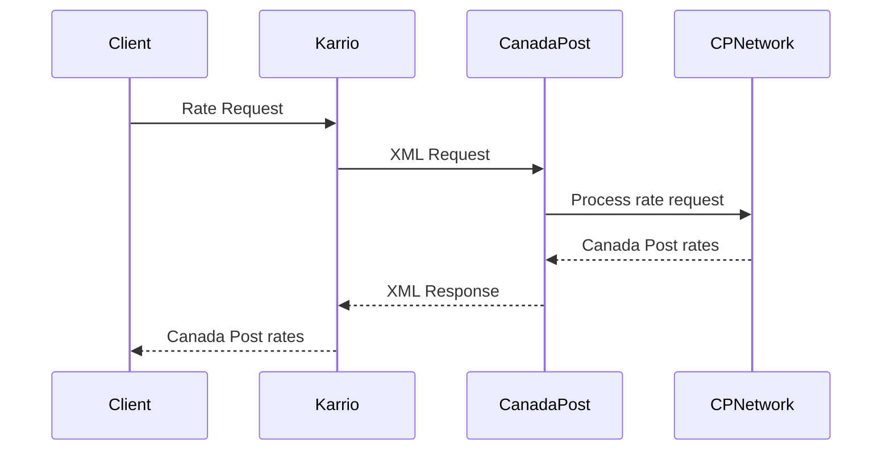

# Canada Post Integration PRD

## Overview

Canada Post is a **direct carrier** integration providing comprehensive shipping services for Canada Post Corporation. This integration supports rating, shipping, tracking, pickup scheduling, and manifest operations through Canada Post's XML REST API, demonstrating Karrio's support for XML-based APIs alongside JSON APIs.

## Architecture

### Direct Carrier Pattern (XML API)

```
Direct Carrier: Karrio → Canada Post XML API → Canada Post Network
Hub Carrier:    Karrio → ShipEngine API → {UPS, FedEx, USPS, +30 carriers}
```

### Key Architectural Characteristics

1. **Plugin Metadata**: `is_hub=False` flag
2. **XML API**: XML-based requests/responses (unlike JSON APIs)
3. **Static Services**: Predefined service enumeration
4. **Single Carrier**: All responses from Canada Post only
5. **HTTP Basic Auth**: Username/password authentication

## Implementation Structure

```
modules/connectors/canadapost/
├── karrio/
│   ├── plugins/canadapost/     # Plugin registration (is_hub=False)
│   ├── mappers/canadapost/     # Integration layer
│   ├── providers/canadapost/   # Business logic (includes pickup/, manifest)
│   └── schemas/canadapost/     # Generated data types (from XSD)
├── schemas/                    # API schema files (XSD)
├── tests/                      # Unit tests
└── generate                    # Schema generation script (XML)
```

## Connection & Authentication

**HTTP Basic Authentication**:
- Username and password/API key for authentication
- Customer number for commercial rates
- Optional contract ID for enhanced pricing
- Test environment: `https://ct.soa-gw.canadapost.ca`
- Production: `https://soa-gw.canadapost.ca`

## Core Features

### 1. Rating Service
- **Endpoint**: `POST /rs/{version}/ship/price`
- **Pattern**: XML-based rate requests
- **Features**: Domestic and international pricing

### 2. Shipment Creation
- **Endpoint**: `POST /rs/{version}/shipment`
- **Pattern**: XML shipment creation
- **Features**: Label generation, customs documentation

### 3. Tracking
- **Endpoint**: `GET /rs/{version}/track/{trackingNumber}`
- **Pattern**: XML tracking responses
- **Features**: Detailed tracking events

### 4. Pickup Scheduling
- **Endpoint**: `POST /rs/{version}/pickup-request`
- **Pattern**: On-demand pickup requests
- **Features**: Pickup scheduling and management

### 5. Manifest Operations
- **Endpoint**: `POST /rs/{version}/manifest`
- **Pattern**: Commercial manifest creation
- **Features**: Bulk shipment manifesting

## Data Flow



## XML API Implementation Patterns

### XML Request/Response Flow
- **Request Serialization**: `lib.Serializable(request, lib.to_xml)`
- **Response Deserialization**: `lib.Deserializable(response, lib.to_element)`
- **Schema Generation**: XSD to Python class generation
- **Namespace Handling**: Proper XML namespace management

### Static Service Enumeration
- Services predefined as static enum values
- Canada Post-specific service codes (e.g., "DOM.EP" for Expedited Parcel)
- No dynamic service discovery

### Single Carrier Processing
- API responses contain only Canada Post rates
- Service identification by static service codes
- CAD currency for domestic shipments

## Schema Generation Configuration

**XML Schema Pattern**:
```bash
# Generate from XSD files using generateDS
./generate
```

## Unique Canada Post Features

### Commercial Contract Support
- **Contract Rates**: Commercial pricing when contract ID provided
- **Manifest Management**: Required for commercial shipments
- **Postal Code Intelligence**: Canadian postal code validation

### XML API Capabilities
- **Namespace Handling**: Proper XML namespace resolution
- **Schema Validation**: XSD schema validation
- **Error Parsing**: XML error response handling

## Testing Patterns

XML-specific testing requirements:
- **Schema Validation**: Test against Canada Post XSD schemas
- **XML Serialization**: Verify proper XML format generation
- **Namespace Handling**: Test XML namespace resolution
- **Error Parsing**: XML error response handling

## Integration Checklist

- [ ] Plugin metadata with `is_hub=False`
- [ ] XML schema generation from XSD files
- [ ] HTTP Basic authentication implementation
- [ ] Static service enumeration
- [ ] XML request/response handling
- [ ] Namespace-aware XML processing
- [ ] Canadian postal code validation
- [ ] Manifest workflow support

## Key Differences from Other Carriers

| Aspect | Canada Post | Direct Carrier (UPS/FedEx) | Hub Carrier |
|--------|-------------|---------------------------|-------------|
| **Location** | `modules/connectors/` | `modules/connectors/` | `community/plugins/` |
| **Metadata** | `is_hub=False` | `is_hub=False` | `is_hub=True` |
| **API Format** | XML | JSON | JSON |
| **Services** | Static CP services | Static services | Dynamic multi-carrier |
| **Results** | Canada Post only | Single carrier | Multiple carriers |
| **Authentication** | HTTP Basic | OAuth 2.0 | API Key |
| **Schema Source** | XSD files | JSON schemas | JSON schemas |
| **Unique Features** | Manifest operations | Pickup scheduling | Multi-carrier aggregation |

## Integration Benefits

### For Karrio Platform
- **XML API Support**: Demonstrates XML integration capabilities
- **Complete Canadian Coverage**: Full Canada Post service portfolio
- **Commercial Features**: Contract rates and manifest support

### For Canadian Businesses
- **Local Expertise**: Native Canadian shipping provider
- **Cost Effective**: Competitive domestic rates
- **Rural Coverage**: Comprehensive Canadian delivery network

### For Developers
- **XML Patterns**: Learn XML API integration patterns
- **Schema Generation**: XSD to Python class generation
- **Namespace Handling**: Proper XML namespace management
