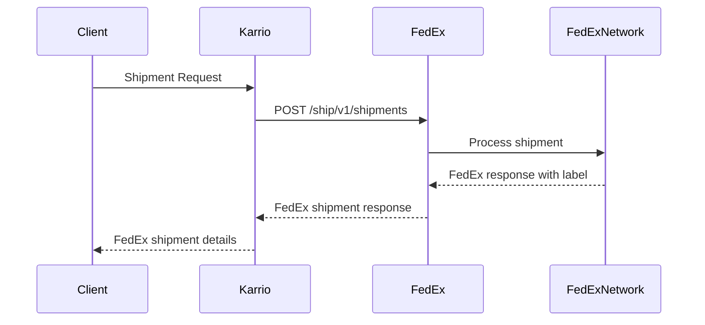

# FedEx Integration PRD

## Overview

FedEx is a **direct carrier** integration providing comprehensive shipping services through FedEx's JSON REST API. This integration supports rating, shipping, tracking, pickup scheduling, and document upload operations with OAuth 2.0 authentication.

## Architecture

### Direct Carrier Pattern

```
Direct Carrier: Karrio → FedEx API → FedEx Network
Hub Carrier:    Karrio → ShipEngine API → {UPS, FedEx, USPS, +30 carriers}
```

### Key Architectural Characteristics

1. **Plugin Metadata**: `is_hub=False` flag
2. **Static Services**: Predefined service enumeration
3. **Single Carrier**: All responses from FedEx only
4. **OAuth 2.0**: Client credentials flow with token caching
5. **Pickup Support**: Advanced pickup scheduling capabilities

## Implementation Structure

```
modules/connectors/fedex/
├── karrio/
│   ├── plugins/fedex/          # Plugin registration (is_hub=False)
│   ├── mappers/fedex/          # Integration layer
│   ├── providers/fedex/        # Business logic (includes pickup/)
│   └── schemas/fedex/          # Generated data types
├── schemas/                    # API schema files (JSON)
├── tests/                      # Unit tests
└── generate                    # Schema generation script
```

## Connection & Authentication

**OAuth 2.0 Implementation**:
- API key and secret key for authentication
- Token caching with automatic refresh
- Test environment: `https://apis-sandbox.fedex.com`
- Production: `https://apis.fedex.com`

## Core Features

### 1. Rating Service
- **Endpoint**: `POST /rate/v1/rates/quotes`
- **Pattern**: Single carrier rate quotes
- **Authentication**: Bearer token

### 2. Shipment Creation
- **Endpoint**: `POST /ship/v1/shipments`
- **Pattern**: FedEx label generation
- **Features**: Multiple package support, various label formats

### 3. Tracking
- **Endpoint**: `POST /track/v1/trackingnumbers`
- **Pattern**: FedEx tracking events and status
- **Multi-Package**: Support for multiple tracking numbers

### 4. Pickup Scheduling
- **Endpoints**:
  - `POST /pickup/v1/pickups` (create)
  - `PUT /pickup/v1/pickups` (update)
  - `DELETE /pickup/v1/pickups/{pickupConfirmationCode}` (cancel)
- **Pattern**: Advanced pickup management
- **Features**: Recurring pickups, special instructions

### 5. Document Upload
- **Endpoint**: `POST /documents/v1/etds/upload`
- **Pattern**: Electronic trade documents
- **International**: Required for cross-border shipments

## Data Flow



## Direct Carrier Implementation Patterns

### Static Service Enumeration
- Services predefined as static enum values
- FedEx-specific service codes (e.g., "FEDEX_GROUND", "PRIORITY_OVERNIGHT")
- No dynamic service discovery

### Single Carrier Rate Parsing
- API responses contain only FedEx rates
- Service identification by static service codes
- Unified pricing structure with FedEx-specific metadata

### Multi-Package Shipment Handling
- FedEx handles multi-package shipments as sequences
- Package count and total weight calculations
- Individual package line items with indexed metadata

## Schema Generation Configuration

**CamelCase API Pattern**:
```bash
# Use --no-nice-property-names to preserve camelCase
kcli codegen generate "$1" "$2" --no-nice-property-names
```

## Unique FedEx Features

### Pickup Management
- **Advanced Scheduling**: Recurring pickups, specific time windows
- **Special Instructions**: Driver notes, access codes
- **Pickup Types**: Regular, express, ground-only
- **Cancellation**: Full pickup cancellation support

### Service-Specific Features
- **Saturday Delivery**: Available for specific services
- **Dangerous Goods**: Specialized handling for hazmat
- **FedEx One Rate**: Flat rate pricing for specific packaging

## Testing Patterns

Direct carriers follow standard test patterns:
- **Service Validation**: Test predefined service codes
- **Single Carrier Results**: Verify FedEx-only responses
- **OAuth Flow**: Test token caching and refresh
- **Pickup Operations**: Test pickup scheduling, modification, cancellation

## Integration Checklist

- [ ] Plugin metadata with `is_hub=False`
- [ ] Static service enumeration
- [ ] OAuth 2.0 implementation with caching
- [ ] CamelCase schema generation
- [ ] Single carrier response parsing
- [ ] FedEx-specific error handling
- [ ] Pickup scheduling support
- [ ] Multi-package shipment handling

## Key Differences from Other Carriers

| Aspect | Direct Carrier (FedEx) | Direct Carrier (UPS) | Hub Carrier |
|--------|----------------------|---------------------|-------------|
| **Location** | `modules/connectors/` | `modules/connectors/` | `community/plugins/` |
| **Metadata** | `is_hub=False` | `is_hub=False` | `is_hub=True` |
| **Services** | Static FedEx services | Static UPS services | Dynamic multi-carrier |
| **Results** | FedEx only | UPS only | Multiple carriers |
| **Authentication** | OAuth 2.0 | OAuth 2.0 | API Key |
| **Pickup Support** | Full featured | Basic | Via individual carriers |
| **Multi-Package** | Sequence-based | Individual requests | Hub-dependent |
