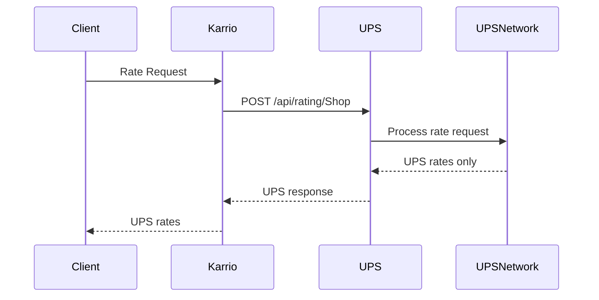

# UPS Integration PRD

## Overview

UPS is a **direct carrier** integration providing comprehensive shipping services through UPS's JSON REST API. This integration supports rating, shipping, tracking, and document upload operations with OAuth 2.0 authentication.

## Architecture

### Direct Carrier Pattern

```
Direct Carrier: Karrio → UPS API → UPS Network
Hub Carrier:    Karrio → ShipEngine API → {UPS, FedEx, USPS, +30 carriers}
```

### Key Architectural Characteristics

1. **Plugin Metadata**: `is_hub=False` flag
2. **Static Services**: Predefined service enumeration
3. **Single Carrier**: All responses from UPS only
4. **OAuth 2.0**: Client credentials flow with token caching

## Implementation Structure

```
modules/connectors/ups/
├── karrio/
│   ├── plugins/ups/            # Plugin registration (is_hub=False)
│   ├── mappers/ups/            # Integration layer
│   ├── providers/ups/          # Business logic
│   └── schemas/ups/            # Generated data types
├── schemas/                    # API schema files (JSON)
├── tests/                      # Unit tests
└── generate                    # Schema generation script
```

## Connection & Authentication

**OAuth 2.0 Implementation**:
- Client ID and secret for authentication
- Token caching with automatic refresh
- Test environment: `https://wwwcie.ups.com`
- Production: `https://onlinetools.ups.com`

## Core Features

### 1. Rating Service
- **Endpoint**: `POST /api/rating/v2409/Shop`
- **Pattern**: Single carrier rate quotes
- **Authentication**: Bearer token

### 2. Shipment Creation
- **Endpoint**: `POST /api/shipments/v1/ship`
- **Pattern**: UPS label generation
- **Features**: Multiple package support, various label formats

### 3. Tracking
- **Endpoint**: `GET /api/track/v1/details/{trackingNumber}`
- **Pattern**: UPS tracking events and status
- **Multi-Package**: Support for multiple tracking numbers

### 4. Document Upload
- **Endpoint**: `POST /api/paperlessdocuments/v1/upload`
- **Pattern**: Commercial invoice and customs documents
- **International**: Required for cross-border shipments

## Data Flow



## Direct Carrier Implementation Patterns

### Static Service Enumeration
- Services predefined as static enum values
- UPS-specific service codes (e.g., "03" for Ground, "01" for Next Day Air)
- No dynamic service discovery

### Single Carrier Rate Parsing
- API responses contain only UPS rates
- Service identification by static service codes
- Unified pricing structure with UPS-specific metadata

## Schema Generation Configuration

**CamelCase API Pattern**:
```bash
# Use --no-nice-property-names to preserve camelCase
kcli codegen generate "$1" "$2" --no-nice-property-names
```

## Testing Patterns

Direct carriers follow standard test patterns:
- **Service Validation**: Test predefined service codes
- **Single Carrier Results**: Verify UPS-only responses
- **OAuth Flow**: Test token caching and refresh

## Integration Checklist

- [ ] Plugin metadata with `is_hub=False`
- [ ] Static service enumeration
- [ ] OAuth 2.0 implementation with caching
- [ ] CamelCase schema generation
- [ ] Single carrier response parsing
- [ ] UPS-specific error handling

## Key Differences from Hub Carriers

| Aspect | Direct Carrier (UPS) | Hub Carrier (ShipEngine) |
|--------|---------------------|-------------------------|
| **Location** | `modules/connectors/` | `community/plugins/` |
| **Metadata** | `is_hub=False` | `is_hub=True` |
| **Services** | Static UPS services | Dynamic multi-carrier |
| **Results** | UPS only | Multiple carriers |
| **Authentication** | OAuth 2.0 | API Key |
| **Field Format** | camelCase | snake_case |
